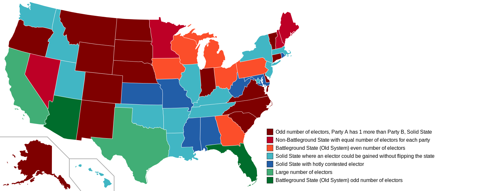

# State Categories

This program categorizes the states into groups based on how important they are under The New Electoral College. Think of it like battleground states under the current system.



# Usage

The program will create an SVG file that shows the states and their categories. It needs 2 text files, both of which are located in the root folder of the repository: `headers.txt` and `stuff.txt`.

In addition, the program needs access to the New Electoral College results database: See [here](https://github.com/NewElectoralCollege/database).

```
$ categories --data-dir=/path/to/database/ --svg-dir=/path/to/txt/files/ --output=output_file.svg
```

Do `categories --help` for further explinations.

# Installation

## Download Source

```
$ git clone https://github.com/NewElectoralCollege/categories.git
$ cd categories
```

## Compilation

Using CMake:

```
$ mkdir build
$ cmake build
```

Without CMake:

```
$ gcc -D INCLUDED_LIB src/main.c src/state.c src/party.c src/rating.c -l json-c -o categories.exe
```

or

```
$ gcc src/main.c -ljson-c -o categories.exe
```

In relation to the `INCLUDED_LIB` macro, `main.c` includes the following code:

```C
#ifndef INCLUDED_LIB
#    include "party.c"
#    include "rating.c"
#    include "state.c"
#endif
```

# Dependency

The only dependency for this program is [json-c](https://github.com/json-c/json-c).

# Specs

This program was written, compiled, and tested using the following:

- The C Programming Language
- GCC version 10.2.0
- [VSCode](https://code.visualstudio.com/)
- CMake version 3.20.0
- json-c version 0.16
